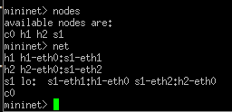

---
## Front matter
lang: ru-RU
title: Лабораторная работа No 1.
author:
  - Тагиев Б. А.
institute:
  - Российский университет дружбы народов, Москва, Россия
date: 18/11/2023

## i18n babel
babel-lang: russian
babel-otherlangs: english

## Formatting pdf
toc: false
toc-title: Содержание
slide_level: 2
aspectratio: 169
section-titles: true
theme: metropolis
mainfont: DejaVu Serif
romanfont: DejaVu Serif
sansfont: DejaVu Sans
monofont: DejaVu Sans Mono
header-includes:
 - \metroset{progressbar=frametitle,sectionpage=progressbar,numbering=fraction}
 - '\makeatletter'
 - '\beamer@ignorenonframefalse'
 - '\makeatother'
---

## Цель работы

Основной целью работы является развёртывание в системе виртуализации (например, в VirtualBox) mininet, знакомство с основными командами для работы с Mininet через командную строку и через графический интерфейс.

## Настройка образа VirtualBox

1. Установить образ Mininet с офицального репозитория Github (https://github.com/mininet/mininet/releases).

2. Запустить систему виртуализации VirtualBox и импортировать образ машины (.OVF файл).

3. Добавить 2 сетевых интерфейса:

 - NAT
 - Host-only adapter и vboxnet0

## Настройка образа VirtualBox

4. После настройки машины, запустить виртуальную машину.

{#fig:001 width=50%}

## Подключение к виртуальной машине

1. Дефолтные учетные данные для авторизации:

 - login: mininet

 - password: mininet

## Подключение к виртуальной машине

2. Для удаленного подключения будем использовать `ssh`:

```
ssh -Y mininet@192.168.x.y
```

{#fig:002 width=50%} 

Параметр `-Y` отвечает за перенаправление сессии X11.

## Подключение к виртуальной машине

3. Для доступа по ключу также следует добавить ключ с хостового устройства на виртуальную машину при помощи `ssh-copy-id`.

```
ssh-copy-id mininet@192.168.x.y
```

## Настройка доступа к Интернету

1. При помощи команды ifconfig можно узнать IP-адреса на интерфейсах:

{#fig:003 width=50%} 

## Настройка доступа к Интернету

2. Для того, чтобы виртуальная машина mininet использовала 2 адаптера при запуске - надо добавить изменения в файл `/etc/netplan/01-netcfg.yaml`.

{#fig:004} 

## Обновление версии Mininet

1. Все файлы связанные с mininet лежат в открытом репозитории на Github, откуда их можно скачать.

{#fig:005 width=50%} 

## Обновление версии Mininet

2. В моем случае, установлена версия `2.3.1`.

{#fig:006} 

## Работа с Mininet с помощью командной строки

1. Для запуска минимальной топологии нужно просто запустить mininet при помощи команды `mn`.

{#fig:007 width=30%} 

## Работа с Mininet с помощью командной строки

2. Можно узнать нынешние узлы и связи можно при помощи следующих команд:

{#fig:008} 

## Работа с Mininet с помощью командной строки

3. Можно запускать команды от имени определенной машины.

{#fig:009} 

## Работа с Mininet с помощью командной строки

4. Для проверки связи между узлами, проведем `ping` от `h1` до `h2`

{#fig:010} 

## Построение и эмуляция сети в Mininet с использованием графического интерфейса

1. Также работать с mininet можно при помощи графического редактора.

```sudo ~/mininet/mininet/examples/miniedit.py```

## Построение и эмуляция сети в Mininet с использованием графического интерфейса

2. Для проверки добавим два хоста и свитч, соединим их и пропишем IP-адреса на устройствах. Далее проведем `ping` от `h1` до `h2`. 

{#fig:011 width=40%} 

## Построение и эмуляция сети в Mininet с использованием графического интерфейса

3. Также можно в автоматическом порядке выдавать адреса, изменив IP-base в топологии сети.

{#fig:012 width=50%} 

## Выводы

По мере выполнения работы, я познакомился с mininet, развернул базовую топологию как в CLI режиме, так и в GUI редакторе.
