---
## Front matter
title: "Введение в Mininet"
author: "Тагиев Байрам Алтай оглы"

## Generic otions
lang: ru-RU
toc-title: "Содержание"

## Bibliography
bibliography: bib/cite.bib
csl: pandoc/csl/gost-r-7-0-5-2008-numeric.csl

## Pdf output format
toc: true # Table of contents
toc-depth: 2
lof: true # List of figures
lot: true # List of tables
fontsize: 12pt
linestretch: 1.5
papersize: a4
documentclass: scrreprt
## I18n polyglossia
polyglossia-lang:
  name: russian
  options:
	- spelling=modern
	- babelshorthands=true
polyglossia-otherlangs:
  name: english
## I18n babel
babel-lang: russian
babel-otherlangs: english
## Fonts
mainfont: PT Serif
romanfont: PT Serif
sansfont: PT Sans
monofont: PT Mono
mainfontoptions: Ligatures=TeX
romanfontoptions: Ligatures=TeX
sansfontoptions: Ligatures=TeX,Scale=MatchLowercase
monofontoptions: Scale=MatchLowercase,Scale=0.9
## Biblatex
biblatex: true
biblio-style: "gost-numeric"
biblatexoptions:
  - parentracker=true
  - backend=biber
  - hyperref=auto
  - language=auto
  - autolang=other*
  - citestyle=gost-numeric
## Pandoc-crossref LaTeX customization
figureTitle: "Рис."
tableTitle: "Таблица"
listingTitle: "Листинг"
lofTitle: "Список иллюстраций"
lotTitle: "Список таблиц"
lolTitle: "Листинги"
## Misc options
indent: true
header-includes:
  - \usepackage{indentfirst}
  - \usepackage{float} # keep figures where there are in the text
  - \floatplacement{figure}{H} # keep figures where there are in the text
---

# Цель работы

Основной целью работы является развёртывание в системе виртуализации (например, в VirtualBox) mininet, знакомство с основными командами для работы с Mininet через командную строку и через графический интерфейс.

# Выполнение работы

## Настройка образа VirtualBox

1. Установить образ Mininet с офицального репозитория Github (https://github.com/mininet/mininet/releases).

2. Запустить систему виртуализации VirtualBox и импортировать образ машины (.OVF файл).

3. Добавить 2 сетевых интерфейса:

 - NAT
 - Host-only adapter и vboxnet0

4. После настройки машины, запустить виртуальную машину.

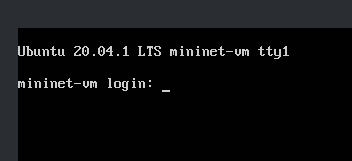{#fig:001}

## Подключение к виртуальной машине

1. Дефолтные учетные данные для авторизации:

 - login: mininet

 - password: mininet

2. Для удаленного подключения будем использовать `ssh`:

```
ssh -Y mininet@192.168.x.y
```

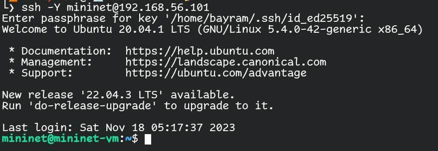{#fig:002} 

Параметр `-Y` отвечает за перенаправление сессии X11.

3. Для доступа по ключу также следует добавить ключ с хостового устройства на виртуальную машину при помощи `ssh-copy-id`.

```
ssh-copy-id mininet@192.168.x.y
```

## Настройка доступа к Интернету

1. При помощи команды ifconfig можно узнать IP-адреса на интерфейсах:

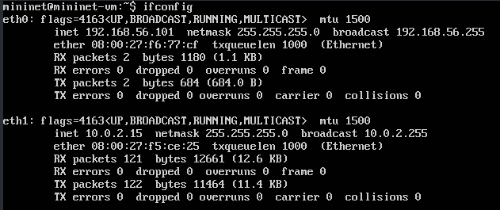{#fig:003} 

2. Для того, чтобы виртуальная машина mininet использовала 2 адаптера при запуске - надо добавить изменения в файл `/etc/netplan/01-netcfg.yaml`.

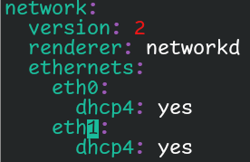{#fig:004} 

## Обновление версии Mininet

1. Все файлы связанные с mininet лежат в открытом репозитории на Github, откуда их можно скачать.

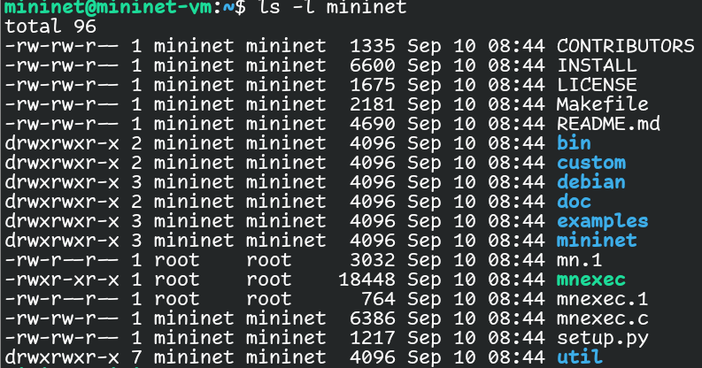{#fig:005} 

2. В моем случае, установлена версия `2.3.1`.

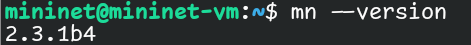{#fig:006} 

## Работа с Mininet с помощью командной строки

1. Для запуска минимальной топологии нужно просто запустить mininet при помощи команды `mn`.

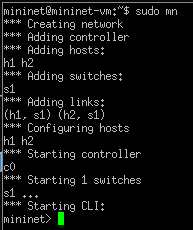{#fig:007} 

2. Можно узнать нынешние узлы и связи можно при помощи следующих команд:

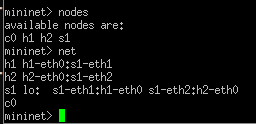{#fig:008} 

3. Можно запускать команды от имени определенной машины.

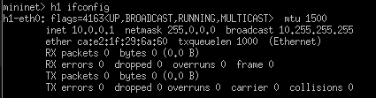{#fig:009} 

4. Для проверки связи между узлами, проведем `ping` от `h1` до `h2`

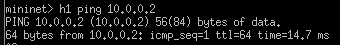{#fig:010} 

## Построение и эмуляция сети в Mininet с использованием графического интерфейса

1. Также работать с mininet можно при помощи графического редактора.

```sudo ~/mininet/mininet/examples/miniedit.py```

2. Для проверки добавим два хоста и свитч, соединим их и пропишем IP-адреса на устройствах. Далее проведем `ping` от `h1` до `h2`. 

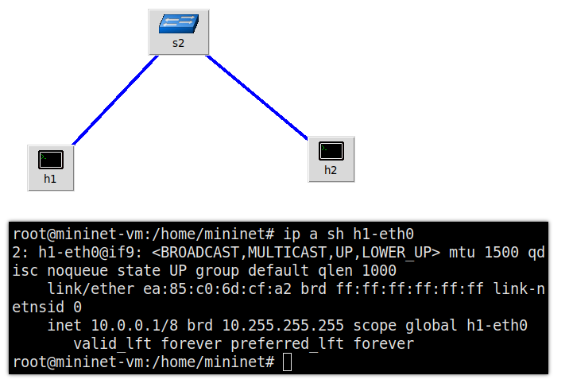{#fig:011} 

3. Также можно в автоматическом порядке выдавать адреса, изменив IP-base в топологии сети.

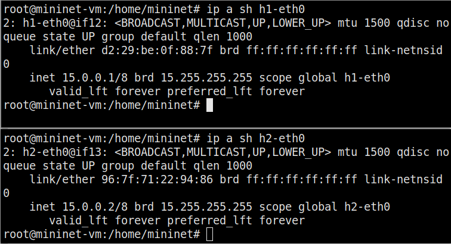{#fig:012} 

# Выводы

По мере выполнения работы, я познакомился с mininet, развернул базовую топологию как в CLI режиме, так и в GUI редакторе.
