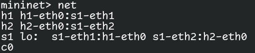
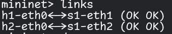
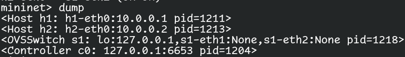
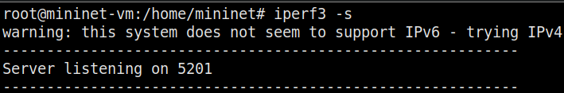
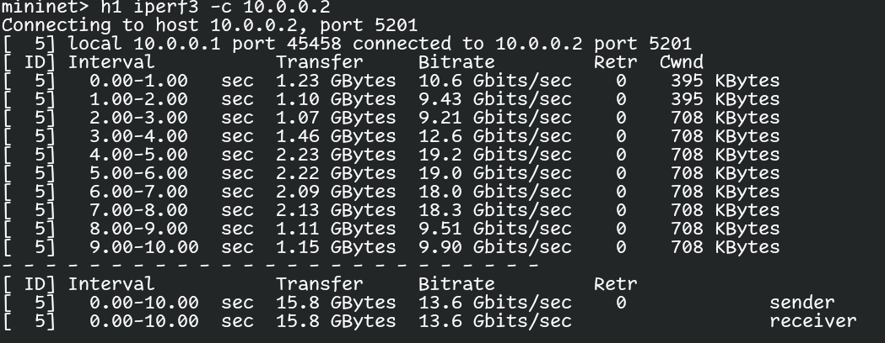
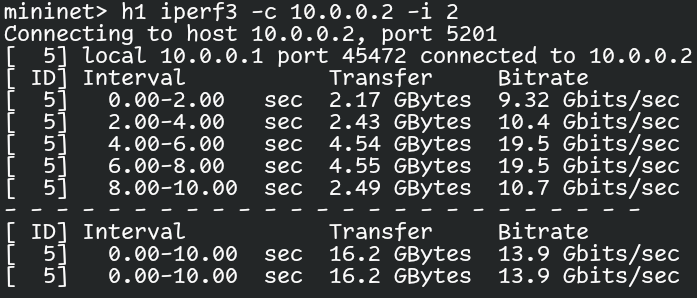
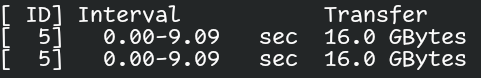
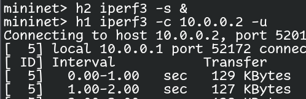
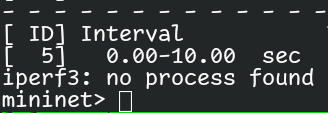
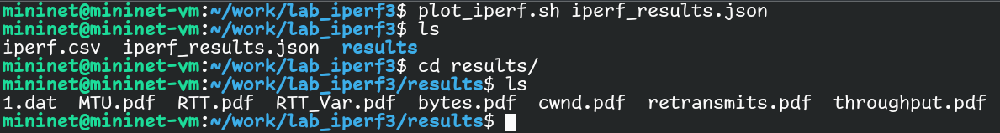

---
## Front matter
lang: ru-RU
title: Лабораторная работа No 2.
author:
  - Тагиев Б. А.
institute:
  - Российский университет дружбы народов, Москва, Россия
date: 25/11/2023

## i18n babel
babel-lang: russian
babel-otherlangs: english

## Formatting pdf
toc: false
toc-title: Содержание
slide_level: 2
aspectratio: 169
section-titles: true
theme: metropolis
mainfont: DejaVu Serif
romanfont: DejaVu Serif
sansfont: DejaVu Sans
monofont: DejaVu Sans Mono
header-includes:
 - \metroset{progressbar=frametitle,sectionpage=progressbar,numbering=fraction}
 - '\makeatletter'
 - '\beamer@ignorenonframefalse'
 - '\makeatother'
 - \usepackage{pdfpages}
---

## Цель работы

Основной целью работы является знакомство с инструментом для измерения пропускной способности сети в режиме реального времени — iPerf3, а также получение навыков проведения интерактивного эксперимента по измерению пропускной способности моделируемой сети в среде Mininet.

## Выполнение работы

1. Создадим простейшую топологию состоящую из двух узлов и коммутатора с сетью $10.0.0.0/8$.

```
sudo mn --topo=single,2 -x
```

## Выполнение работы

2. Посмотрим информацию о нынешней топологии.

 - Команда `net` покажет какие есть узлы и сетевые соединения на них.

{#fig:001 width=50%} 

## Выполнение работы

 - Команда `links` покажет какие есть активные сетевые соединения.

{#fig:002 width=50%} 

## Выполнение работы

 - Команда `dump` покажет нынешнюю конфигурацию сети, IP-адреса и т.д. в XML формате.

{#fig:003 width=50%} 

## Выполнение работы

3. Проведем простейшее тестирование при помощи iperf3. На `h2` запустим iperf3-сервер .

{#fig:004 width=50%} 

## Выполнение работы

На хосте `h1` запустим клиентскую сторону iperf3  и далее запуститься проверка пропускной способности между узлами `h1` и `h2`.

{#fig:005 width=50%} 

## Выполнение работы

4. Для iperf3 также можно задать время работы клиента, при помощи ключа `-t`. Также можно изменить интервал времени отсчета  при помощи ключа `-i`.

{#fig:006 width=50%} 

## Выполнение работы

5. При помощи ключа `-n` можно указать необходимый объем передаваемых данных. iPerf3 будет продолжать отправлять пакеты до тех пор, пока не будет отправлен весь объем данных, указанный
пользователем.

{#fig:007 width=50%} 

## Выполнение работы

6. Для изменения протокола передачи данных с `TCP` на `UDP` есть ключ `-u`.

{#fig:008 width=50%} 

## Выполнение работы

7. Ключ `-1` на серверной части отвечает за отключение сервера iperf3 после первого теста.

{#fig:009 width=50%} 

## Выполнение работы

8. Если нам нужно как-либо анализировать пропускную способность и прочие данные о соединении, то для этого есть ключ `-J`, который выводит всю информацию в формате `JSON`, которую затем можно использовать для построения различных графиков .

{#fig:011 width=50%} 

## Выполнение работы

Полученные графики:

 - окно перегрузки (cwnd.pdf);
 - повторная передача (retransmits.pdf);
 - время приема-передачи (RTT.pdf);
 - отклонение времени приема-передачи (RTT_Var.pdf);
 - пропускная способность (throughput.pdf);
 - максимальная единица передачи (MTU.pdf);
 - количество переданных байтов (bytes.pdf).
 
## Выводы

По мере выполнения данной лабораторной работы, я приобрел практические навыки работы с Iperf3, изучил ключи этой команды и научился извлекать графики для последующего анализа.

