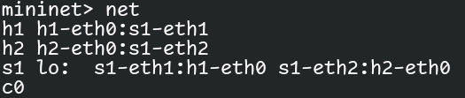
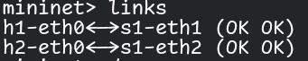
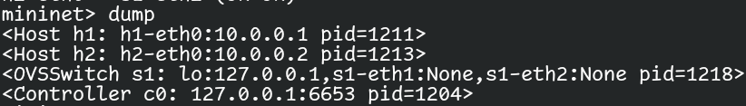
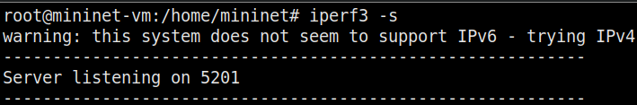
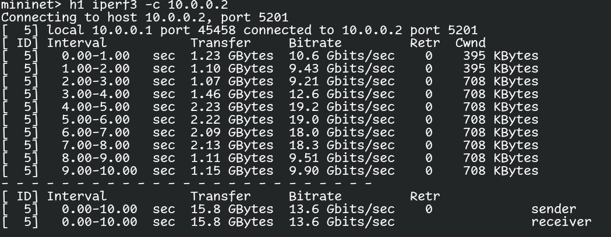
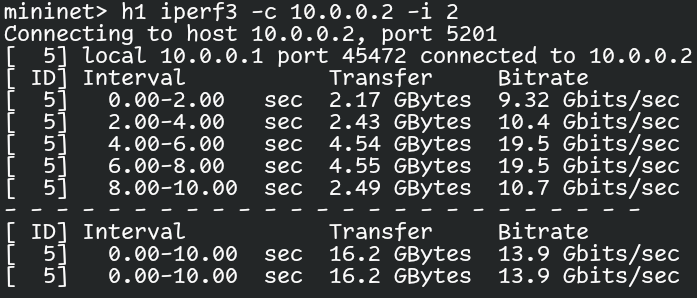
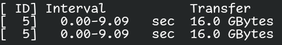
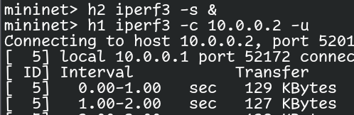
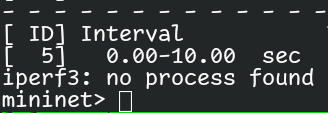
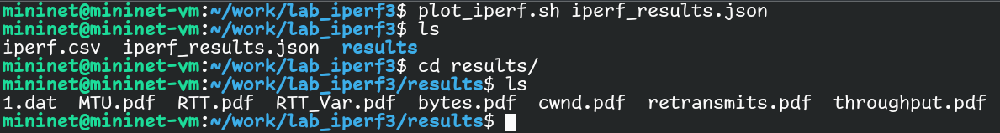

---
## Front matter
title: "Лабораторная работа № 2"
author: "Тагиев Байрам Алтай оглы"

## Generic otions
lang: ru-RU
toc-title: "Содержание"

## Bibliography
bibliography: bib/cite.bib
csl: pandoc/csl/gost-r-7-0-5-2008-numeric.csl

## Pdf output format
toc: true # Table of contents
toc-depth: 2
lof: true # List of figures
lot: true # List of tables
fontsize: 12pt
linestretch: 1.5
papersize: a4
documentclass: scrreprt
## I18n polyglossia
polyglossia-lang:
  name: russian
  options:
	- spelling=modern
	- babelshorthands=true
polyglossia-otherlangs:
  name: english
## I18n babel
babel-lang: russian
babel-otherlangs: english
## Fonts
mainfont: PT Serif
romanfont: PT Serif
sansfont: PT Sans
monofont: PT Mono
mainfontoptions: Ligatures=TeX
romanfontoptions: Ligatures=TeX
sansfontoptions: Ligatures=TeX,Scale=MatchLowercase
monofontoptions: Scale=MatchLowercase,Scale=0.9
## Biblatex
biblatex: true
biblio-style: "gost-numeric"
biblatexoptions:
  - parentracker=true
  - backend=biber
  - hyperref=auto
  - language=auto
  - autolang=other*
  - citestyle=gost-numeric
## Pandoc-crossref LaTeX customization
figureTitle: "Рис."
tableTitle: "Таблица"
listingTitle: "Листинг"
lofTitle: "Список иллюстраций"
lotTitle: "Список таблиц"
lolTitle: "Листинги"
## Misc options
indent: true
header-includes:
  - \usepackage{indentfirst}
  - \usepackage{float} # keep figures where there are in the text
  - \floatplacement{figure}{H} # keep figures where there are in the text
---

# Цель работы

Основной целью работы является знакомство с инструментом для измерения пропускной способности сети в режиме реального времени — iPerf3, а также получение навыков проведения интерактивного эксперимента по измерению пропускной способности моделируемой сети в среде Mininet.

# Выполнение работы

1. Создадим простейшую топологию состоящую из двух узлов и коммутатора с сетью $10.0.0.0/8$.

```
sudo mn --topo=single,2 -x
```

2. Посмотрим информацию о нынешней топологии.

 - Команда `net`@fig:001 покажет какие есть узлы и сетевые соединения на них.

{#fig:001 width=50%} 

 - Команда `links`@fig:002 покажет какие есть активные сетевые соединения.

{#fig:002 width=50%} 

 - Команда `dump`@fig:003 покажет нынешнюю конфигурацию сети, IP-адреса и т.д. в XML формате.

{#fig:003 width=50%} 

3. Проведем простейшее тестирование при помощи iperf3. На `h2` запустим iperf3-сервер @fig:004.

{#fig:004 width=50%} 

На хосте `h1` запустим клиентскую сторону iperf3 @fig:005 и далее запуститься проверка пропускной способности между узлами `h1` и `h2`.

{#fig:005 width=50%} 

4. Для iperf3 также можно задать время работы клиента, при помощи ключа `-t`. Также можно изменить интервал времени отсчета @fig:006 при помощи ключа `-i`.

{#fig:006 width=50%} 

5. При помощи ключа `-n`@fig:007 можно указать необходимый объем передаваемых данных. iPerf3 будет продолжать отправлять пакеты до тех пор, пока не будет отправлен весь объем данных, указанный
пользователем.

{#fig:007 width=50%} 

6. Для изменения протокола передачи данных с `TCP` на `UDP` есть ключ `-u`@fig:008.

{#fig:008 width=50%} 

7. Ключ `-1`@fig:009 на серверной части отвечает за отключение сервера iperf3 после первого теста.

{#fig:009 width=50%} 

8. Если нам нужно как-либо анализировать пропускную способность и прочие данные о соединении, то для этого есть ключ `-J`, который выводит всю информацию в формате `JSON`, которую затем можно использовать для построения различных графиков @fig:011.

{#fig:011 width=50%} 

Полученные графики:

 - окно перегрузки (cwnd.pdf);

\includegraphics{files/cwnd.pdf}

 - повторная передача (retransmits.pdf);

\includegraphics{files/retransmits.pdf}

 - время приема-передачи (RTT.pdf);

\includegraphics{files/RTT.pdf}

 - отклонение времени приема-передачи (RTT_Var.pdf);

\includegraphics{files/RTT_Var.pdf}

 - пропускная способность (throughput.pdf);

\includegraphics{files/throughput.pdf}

 - максимальная единица передачи (MTU.pdf);

\includegraphics{files/MTU.pdf}

 - количество переданных байтов (bytes.pdf).

\includegraphics{files/bytes.pdf}

 
# Выводы

По мере выполнения данной лабораторной работы, я приобрел практические навыки работы с Iperf3, изучил ключи этой команды и научился извлекать графики для последующего анализа.

